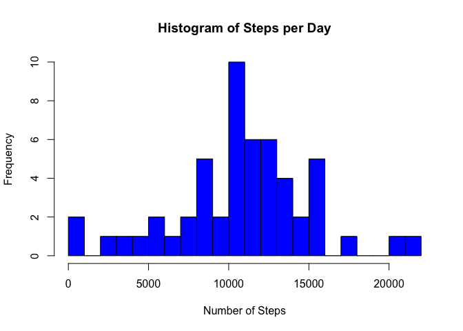
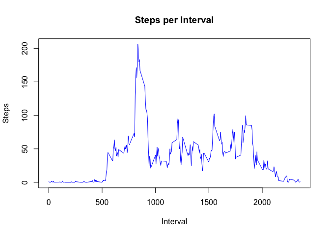
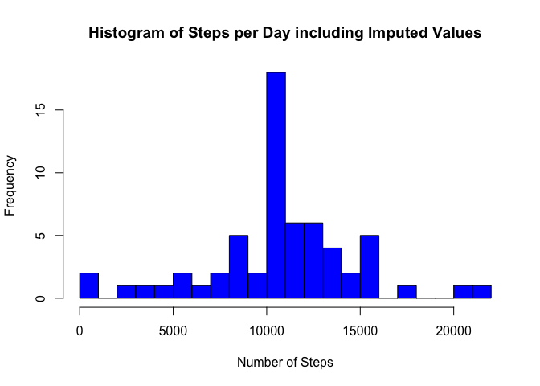

# Reproducible Research: Peer Assessment 1


Load all libraries required for this script.  Note that messages are disabled for this block.

```r
library(dplyr)
library(lattice)
```

## Loading and preprocessing the data

Read in the raw data from the csv file

```r
data <- read.csv("activity.csv")
str(data)
```

```
## 'data.frame':	17568 obs. of  3 variables:
##  $ steps   : int  NA NA NA NA NA NA NA NA NA NA ...
##  $ date    : Factor w/ 61 levels "2012-10-01","2012-10-02",..: 1 1 1 1 1 1 1 1 1 1 ...
##  $ interval: int  0 5 10 15 20 25 30 35 40 45 ...
```

## What is the mean total number of steps per day?

Calculate the total number of steps per day.

```r
dailySteps <- group_by(data, date)
totalDailySteps <- summarize(dailySteps, totalsteps = sum(steps))
totalDailySteps
```

```
## # A tibble: 61 × 2
##          date totalsteps
##        <fctr>      <int>
## 1  2012-10-01         NA
## 2  2012-10-02        126
## 3  2012-10-03      11352
## 4  2012-10-04      12116
## 5  2012-10-05      13294
## 6  2012-10-06      15420
## 7  2012-10-07      11015
## 8  2012-10-08         NA
## 9  2012-10-09      12811
## 10 2012-10-10       9900
## # ... with 51 more rows
```

Create a histogram which shows the frequency for
ranges of daily steps.

```r
hist(totalDailySteps$totalsteps, breaks = 20, main = "Histogram of Steps per Day",
   xlab = "Number of Steps", col = "blue")
```

<!-- -->

## What is the average daily activity pattern?

Calculate the mean number of steps across all days

```r
mn <- mean(totalDailySteps$totalsteps, na.rm = TRUE)
```

The mean number of steps across all days is 10766.18867925 steps.

Calculate the median number of steps across all days

```r
mdn <- median(totalDailySteps$totalsteps, na.rm = TRUE)
```

The median number of steps across all days is 10765 steps.

Find the mean number of steps for each interval

```r
intervals <- group_by(data, interval)
meanSteps <- summarize(intervals, meansteps = mean(steps, na.rm = TRUE))
head(meanSteps)
```

```
## # A tibble: 6 × 2
##   interval   meansteps
##      <int>       <dbl>
## 1        0 1.716981132
## 2        5 0.339622642
## 3       10 0.132075472
## 4       15 0.150943396
## 5       20 0.075471698
## 6       25 2.094339623
```

Plot number of steps by the interval

```r
plot(meanSteps$interval, meanSteps$meansteps, type = "l", main = "Steps per Interval", xlab = "Interval", ylab = "Steps", col = "blue")
```

<!-- -->

Find the interval with the maximum number of steps, on average across all days

```r
intvl <- meanSteps[which.max(meanSteps$meansteps),]
```

The interval with the maximum number of steps, on average, across all days is 835 with 206.16981132 steps.

Find the number of rows with NA values and multiply by 100 to get percentage.

```r
totalnas <- sum(is.na(data$steps))
nas <- mean(is.na(data$steps)) 
nas <- nas * 100
```

2304 rows in the dataset are missing values.  This is 13.1147541% of the rows.

## Imputing missing values

The strategy I will use to impute missing values is to replace the NA value for an interval
with the mean NA value for that interval across all days.

Create a new dataset and replace NA values with the mean for the interval

```r
filledData <- data

# Get the indices of the NA values
v <- which(is.na(filledData$steps))

# for each entry with an NA value, look up the mean for that
# it interval replace the NA with that value
for (i in v) {
    index <- which(meanSteps$interval == filledData[i,]$interval)
    filledData[i,]$steps <- meanSteps[index,]$meansteps
}

head(filledData)
```

```
##         steps       date interval
## 1 1.716981132 2012-10-01        0
## 2 0.339622642 2012-10-01        5
## 3 0.132075472 2012-10-01       10
## 4 0.150943396 2012-10-01       15
## 5 0.075471698 2012-10-01       20
## 6 2.094339623 2012-10-01       25
```

Calculate the number of steps taken per day using the data
with imputed values

```r
dailyStepsFilled <- group_by(filledData, date)
stepSumsFilled <- summarize(dailyStepsFilled, totalsteps = sum(steps))
head(stepSumsFilled)
```

```
## # A tibble: 6 × 2
##         date totalsteps
##       <fctr>      <dbl>
## 1 2012-10-01  10766.189
## 2 2012-10-02    126.000
## 3 2012-10-03  11352.000
## 4 2012-10-04  12116.000
## 5 2012-10-05  13294.000
## 6 2012-10-06  15420.000
```

Create a histogram which shows the frequency for
ranges of daily steps.  Use the dataset with imputed values.

```r
hist(stepSumsFilled$totalsteps, breaks = 20, main = "Histogram of Steps per Day including Imputed Values",
   xlab = "Number of Steps", col = "blue")
```

<!-- -->

Calculate the mean number of steps across all days

```r
mn <- mean(stepSumsFilled$totalsteps)
```
The mean number of steps in the dataset with imputed values is 10766.18867925.

Calculate the median number of steps across all days

```r
mdn <- median(stepSumsFilled$totalsteps)
```

The median number of steps in the dataset with imputed values is 10766.18867925.

## Are there differences in activity patterns between weekdays and weekends?

Create a new column to indicate weekday or weekend

```r
weekend <- function(date) weekdays(as.Date(date)) %in% c("Saturday","Sunday")
filledData <- mutate(filledData, daytype = ifelse(weekend(date), "weekend", "weekday"))
filledData$daytype <- as.factor(filledData$daytype)
str(filledData)
```

```
## 'data.frame':	17568 obs. of  4 variables:
##  $ steps   : num  1.717 0.3396 0.1321 0.1509 0.0755 ...
##  $ date    : Factor w/ 61 levels "2012-10-01","2012-10-02",..: 1 1 1 1 1 1 1 1 1 1 ...
##  $ interval: int  0 5 10 15 20 25 30 35 40 45 ...
##  $ daytype : Factor w/ 2 levels "weekday","weekend": 1 1 1 1 1 1 1 1 1 1 ...
```

Calculate steps by interval for weekend and weekdays

```r
daytypeIntervals <- group_by(filledData, daytype, interval)
meanStepsByInterval <- summarize(daytypeIntervals, steps = mean(steps, na.rm = TRUE))
meanStepsByInterval <- arrange(meanStepsByInterval, interval)

# Display a few lines to show the breakout of weekend and weekday
meanStepsByInterval[300:309,]
```

```
## Source: local data frame [10 x 3]
## Groups: daytype [2]
## 
##    daytype interval     steps
##     <fctr>    <int>     <dbl>
## 1  weekend     1225 59.583726
## 2  weekday     1230 62.574004
## 3  weekend     1230 31.683962
## 4  weekday     1235 30.744235
## 5  weekend     1235 37.114387
## 6  weekday     1240 21.981551
## 7  weekend     1240 39.316038
## 8  weekday     1245 29.320335
## 9  weekend     1245 61.404481
## 10 weekday     1250 32.785325
```

Graph the number of steps per interval, for weekend and weekdays

```r
xyplot(steps ~ interval | daytype, data = meanStepsByInterval, layout = c(1, 2), type = "l", ylab = "Number of Steps", xlab = "Interval")
```

<!-- -->
